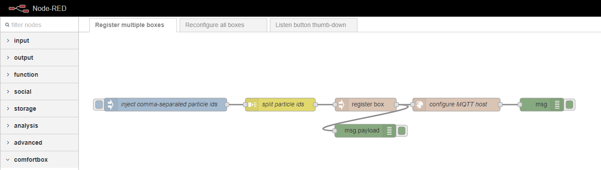

# node-red-contrib-comfortbox
_node-red-contrib-comfortbox_ is a [Node-RED](https://nodered.org/) package containing nodes for configuring and using the ComfortBox API services (https://github.com/dwettstein/comfortbox-api-services).

## Overview
The package contains the following Node-RED nodes:

- `comfortbox-api-server` \- A configuration node to set the API endpoint.
- `register box` \- A node to register a new comfortbox device to the API services.
- `configure box`\- A node to configure a registered comfortbox device (e.g. set the MQTT host).
- `query data` \- A node to query data of a comfortbox device.
- `display text` \- A node to display a text on a comfortbox device.
- `display color` \- A node to display one or multiple colors on a comfortbox device.

## Example flows
For adding the examples to your Node-RED installation, just copy the content of the file [Usecase flows](./examples/usecase_flows.json) and import it to Node-RED using the clipboard import.

### Usecase register
This usecase shows how to register multiple comfortbox devices to the API services.

### Usecase button
This usecase shows an example of how to add functionality to a button.

## Installation
Currently, the package is not yet available from the _npm repository_. For installing the nodes, just clone the repository into your Node-RED user folder (usually `~/.node-red/nodes`) and run `npm install .`.

