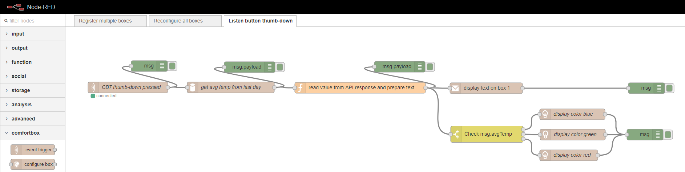

# node-red-contrib-comfortbox
_node-red-contrib-comfortbox_ is a [Node-RED](https://nodered.org/) package containing nodes for configuring and using the ComfortBox API services (https://github.com/dwettstein/comfortbox-api-services).

## Overview
The package contains the following Node-RED nodes:

- `comfortbox-amqp-server` \- A configuration node to set an AMQP endpoint for the event trigger.
- `comfortbox-api-server` \- A configuration node to set the API endpoint.
- `event trigger` \- A node to trigger a flow from an AMQP event.
- `configure box`\- A node to configure a registered ComfortBox device (e.g. set the MQTT host).
- `display color` \- A node to display one or multiple colors on a ComfortBox device.
- `display text` \- A node to display a text on a ComfortBox device.
- `query data` \- A node to query data of a ComfortBox device.
- `register box` \- A node to register a new ComfortBox device to the API services.

## Example flows
For adding the examples to your Node-RED installation, just copy the content of the file [Usecase flows](./examples/usecase_flows.json) and import it to Node-RED using the clipboard import.

### Use Case 1: Register multiple devices
This use case shows how to register multiple comfortbox devices to the API services.

### Use Case 2: Reconfigure all devices
This use case shows how to reconfigure all registered devices (e.g. changing the MQTT host).

### Use Case 3: Listen to button thumb-down
This use case shows an example of how to listen to a specific event. This can also be used to add functionality to the device buttons.

## Installation
Currently, the package is not yet available from the _npm repository_. For installing the nodes, just clone the repository into your Node-RED user folder (usually `~/.node-red/nodes`) and run `npm install .`.
